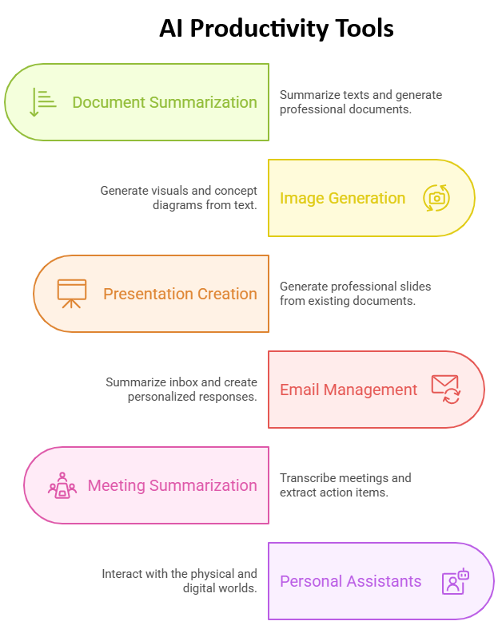

# 1. Introduction to AI for Productivity

AI productivity tools are applications powered by artificial intelligence that help automate, enhance, or accelerate everyday tasks. These tools include generative models for writing and summarizing documents, image generators for creating visuals, smart assistants for managing emails and meetings, personal assistants, and integrated platforms like Microsoft Copilot or Google Workspace AI. They aim to reduce manual effort, improve quality and consistency, and allow users to focus on higher-level thinking and decision-making. From drafting reports and organizing emails to summarizing documents or generating presentations, AI productivity tools are transforming how professionals work across industries.

## 1.2 Welcome and Workshop Overview

- Brief introduction to the workshop’s purpose and goals
- Overview of the structure: hands-on, use-case driven, prompt-based learning
- Icebreaker: "How are you currently using AI?"



## 1.3 What AI Can Do for You

- Use cases of AI in daily work (writing, summarizing, emailing, analyzing, visualizing, automating)
- Examples from different sectors: education, business, research, administration, marketing
- How AI tools integrate with familiar platforms (e.g., Google Docs, Outlook, Teams, PowerPoint)

## 1.4 Prompt Engineering Basics

### 🎯 Learning Objectives
- Understand the purpose and scope of prompt engineering.
- Identify the components that make up an effective prompt.
- Identify and apply different types of prompt design patterns.
- Compare how prompt structures influence AI outputs.
- Practice prompt improvement through iteration.

### 📚 What is Prompt Engineering?

Prompt engineering is the practice of crafting effective inputs (prompts) for large language models (LLMs) to produce accurate, relevant, and useful outputs.

Unlike traditional programming, where you write rigid code, prompt engineering is about **communicating naturally** with an AI system — and doing so **strategically**.

### 🔍 Anatomy of a Prompt

A good prompt typically includes:

1. **Instruction**: What you want the model to do.
   - _e.g., "Summarize the text below in bullet points."_
2. **Context** (optional): Background information or framing.
   - _e.g., "You are a customer support agent."_
3. **Input Data**: The text, question, or file the model will process.
   - _e.g., "Customer review: The product broke in 2 days..."_
4. **Output Format** (optional): Desired structure or style.
   - _e.g., "Respond in JSON format with sentiment and category."_

### 💡 Why Prompt Engineering Matters

- It **boosts model performance** without changing the model itself.
- It helps tailor responses to specific **tasks and audiences**.
- It allows you to guide the model toward **more reliable, interpretable results**.

### 🔧 Example Prompt
```
You are a scientific editor. Summarize the text below into 3 bullet points for a general audience.

Text:
Prompt engineering is the practice of crafting effective inputs (prompts) to guide generative AI models like ChatGPT, Claude, or Gemini toward producing accurate, relevant, and useful outputs. It involves understanding how AI interprets language and strategically structuring prompts to achieve specific goals, whether it is summarizing text, generating code, analyzing data, or creating content. Good prompt engineering can significantly enhance the quality of AI responses, making it a critical skill for maximizing productivity and creativity with AI tools.
```

### 🧠 Exercise 1: Deconstruct This Prompt

Given the prompt below, identify its components:
```
You are a legal assistant. Given the client's message, extract the key legal issue and relevant date in bullet points.

Message:
I was evicted without notice on June 3rd even though I paid rent until July...
```

### 🧠 Why Prompt Patterns Matter

Prompt patterns are reusable structures that help you get consistent, high-quality results from language models. Understanding them empowers you to choose the right style for your goal.

### 🧾 Common Prompt Types

1. **Instructional Prompts**
Directly ask the model to perform a task, e.g.:
```
"Summarize the following article in three sentences."
```
2. **Role-Based Prompts**
Assign the model a specific identity or role to guide tone and knowledge.
```
You are a career coach. Give me advice on how to negotiate a salary raise.
```
3. **Chain-of-Thought Prompts**
Encourage step-by-step reasoning or breakdown of complex tasks.
```
What is the square root of 144? Explain the steps before giving the answer.
```
4. **Zero-Shot Prompts**
Provide only the instruction and input — no examples.
```
Translate the following sentence into Portuguese: "How are you?"
```
5. **Few-Shot Prompts**
Include examples of input/output pairs to guide the model.
```
Translate the following:
English: Good morning → Portuguese: Bom dia
English: Thank you → Portuguese: Obrigado
English: I’m hungry → Portuguese:
```
### Prompt Comparison

| Pattern           | Use Case                               | Example Role/Task                              |
|------------------|----------------------------------------|------------------------------------------------|
| Instructional     | Clear single-step tasks                 | “Summarize this paragraph.”                    |
| Role-Based        | Tone/personality alignment              | “You are a financial advisor…”                |
| Chain-of-Thought  | Complex reasoning, multi-step problems  | “Explain each step before giving the answer.”  |
| Zero-Shot         | Fast and generic tasks                  | “Translate to Spanish…”                       |
| Few-Shot          | Custom structure or format              | “English → French examples…”                  |

### 🧠 Exercise 2: Prompt Comparison Activity

Use the following task and try prompting it in three different styles.

**Task**: Recommend three books for someone interested in artificial intelligence.

### 🧪 Why Iteration Matters

Prompting is often **not a one-shot process**. Even good prompts may return incomplete, vague, or misleading results. The key is to **test, analyze, and refine**.

Iteration helps you:
- Clarify vague requests
- Add or remove unnecessary detail
- Adjust tone or output format
- Explore different framing approaches

### 🛠️ The Iterative Prompting Process

1. **Draft the initial prompt**  
   _Write a basic version of your request._

2. **Review the output**  
   _Is it accurate? Detailed enough? In the right tone or format?_

3. **Refine the prompt**  
   _Add missing instructions, clarify goals, or adjust roles._

4. **Test again**  
   _Compare outputs, note improvements, and repeat if needed._

### Prompt Iteration and Debugging Examples

**Poor Prompt:**
```
Explain climate change.
```
**Improved Prompt (Iteration 1):**
```
Explain climate change in simple terms for a high school student, using 3 key points.
```
**Improved Prompt (Iteration 2):**
```
Explain climate change in simple terms for a high school student. Use 3 bullet points and include one analogy related to daily life.
```
### ⚠️ Tips for Troubleshooting and Improving Prompts

- If output is **too generic**: Add specific instructions or examples.
- If output **hallucinates**: Ask the model to “only use provided information.”
- If output **misses important parts**: Reframe the prompt with clearer structure.
- If output is **inconsistent**: Use role and format specifications.

**Hallucination** is when a model confidently outputs incorrect or invented information.
  
### Assessing Prompt Quality

Five criteria to judge the effectiveness of a prompt-output pair:

| Criterion         | Description                                                                 |
|------------------|-----------------------------------------------------------------------------|
| **Relevance**     | Is the response aligned with the prompt's intent?                          |
| **Completeness**  | Does the answer cover all requested aspects?                               |
| **Clarity**       | Is the response easy to understand and well-structured?                    |
| **Factual Accuracy** | Are the claims and data points correct and verifiable?                 |
| **Format**        | Does the output follow the requested format or style?                      |

**Techniques to Reduce or Identify Hallucinations**
- Ask the model to **cite its sources** or say "Only use the provided text/file."
- Clarify that the model should say **“I don't know”** if unsure.
- Specify that the answer should be based **only on the uploaded file** or context.

## 1.5 Ethical Considerations

- Responsible use: data privacy, bias, hallucinations, transparency
- Examples of misuse and how to avoid them
- When *not* to use AI or when to rely on human judgment

## 1.6 Wrap-Up Reflection

- What did you learn about AI tools that surprised you?
- Which AI tasks are you most comfortable with?
- What task in your work would you most like to streamline with AI?
- What did you learn about prompt engineering?
