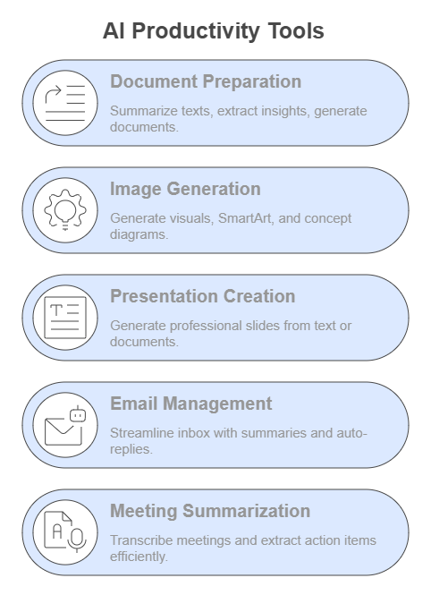

# Welcome to the *AI Productivity Tools* Workshop

## Empowering Your Workflow with AI

Artificial Intelligence (AI) is rapidly transforming the way we work, communicate, and manage information. In this hands-on workshop, we explore how AI-powered tools can be seamlessly integrated into everyday professional tasks to significantly boost productivity, creativity, and decision-making.

This workshop is part of the **Dendritic Institute**'s mission to advance AI and Data Science education through human-centered approaches. Designed for professionals, educators, researchers, and students alike, this session emphasizes **practical applications** and **ethical considerations** surrounding the use of generative AI technologies.

## 1. What You'll Learn

Participants will explore AI tools across the following domains:

- **Document Summarization and Preparation**  
  Learn how to summarize texts, extract key insights, and generate professional-quality documents using tools like ChatGPT, Claude.ai, and Perplexity AI.

- **Image and Diagram Generation**  
  Generate high-quality visuals, SmartArt, and concept diagrams from text or bullet lists with tools like ChatGPT-4o, Meta.ai, and Napkin.ai.

- **Slide and Presentation Creation**  
  Automatically generate engaging, professional slides from existing text or documents using Gamma.app and Microsoft Copilot.

- **Email Management and Communication**  
  Streamline your inbox with smart summaries, auto-replies, and personalized responses using AI tools.

- **Meeting Transcription and Summarization**  
  Use tools like Otter.ai and Fireflies.ai to transcribe meetings, extract action items, and share summarized notes with your team.

## 2. Structure and Approach

Each session is structured around a short introduction, hands-on activity, and a reflection period. You will be encouraged to:

- Experiment with AI prompts tailored to your professional context
- Compare outputs across different tools
- Share findings and discuss best practices
- Develop your own AI-enhanced productivity workflow

At the end of the workshop, participants will complete a final project applying AI tools to a task relevant to their field or organization.

No programming experience is required. The focus is on building your ability to extract business-oriented insights, visualize relationships, and tell impactful stories with data, both with and without AI. By the end of this course, you will be equipped to apply AI-augmented workflows to real-world data projects and contribute to a data-driven culture in any organization.

## 1.1 Program Structure and Summary

This training is structured into five classes, each building on the previous to provide a comprehensive journey from foundational concepts to a full AI-enhanced data analysis project:

### Class 1: Introduction to Data Analysis, AI Tools, and Careers
- Covers the basics of AI and AI-enhanced data analysis.
- Introduces main AI tools (ChatGPT, Claude.ai, Perplexity).
- Explores careers in data science, key terminologies, and principles of prompt engineering.
- Discusses best practices in data analysis and the differences between standard and AI-based approaches.
- Introduces the basics of prompt engineering.
[Download the slide deck.](./DA2I_Class01_Introduction.pdf)

### Class 2: Data Analysis Workflow and Descriptive Data Analysis
- Focuses on the data analysis workflow, including data description and preparation.
- Introduces descriptive data analysis (DDA), covering how to summarize and characterize data using statistical methods.
- Begins to integrate AI tools for data preparation and analysis.
[Download the slide deck.](./DA2I_Class02_DD_DDA.pdf)

### Class 3: Data Visualization and Design Principles
- Explores different types of data distributions, associations, proportions, and trends.
- Introduces geospatial analysis and key design principles for effective data visualization.
- Demonstrates how AI can enhance data visualization and support analysis.
[Download the slide deck.](./DA2I_Class03_Dataviz.pdf)

### Class 4: Data Storytelling and Dashboard Design
- Focuses on crafting compelling data stories and designing impactful dashboards.
- Includes case studies to apply storytelling techniques and dashboard best practices.
- Emphasizes the use of AI tools to enhance storytelling and dashboard creation.
[Download the slide deck.](./DA2I_Class04_Storytelling_Dashboard.pdf)

### Class 5: Full Data Analysis Project with AI Integration
- Culminates in a capstone project where participants apply the entire AI-augmented analysis workflow.
- Covers project requirements, learning objectives, and integrates all skills learned throughout the course.
- Encourages critical discussion on the limitations, ethics, and accuracy of AI-generated outputs.
[Download the slide deck.](./DA2I_Class05_FinalClass.pdf)

## 1.2 Datasets Summary

The training uses a diverse set of datasets to illustrate practical data analysis and AI-augmented workflows. Here is a summary of the datasets featured in the examples:

- **Car Evaluation Dataset**: Contains attributes such as buying price, maintenance cost, doors, seating capacity, trunk size, safety, and an overall acceptability class. Used for data description, tabular representation, and creating data dictionaries. [Download the Cars dataset.](./mpg.csv)
- **Mammographic Masses Dataset**: Medical dataset with variables like BI-RADS assessment, patient age, mass shape, margin, density, and severity (benign or malignant). Used for handling missing values, sampling, and contingency analysis. [Download the Mammographic dataset.](./mammographic_masses_nominal.csv)
- **Iris Dataset**: Classic dataset with sepal and petal measurements for three iris species. Demonstrates normalization and descriptive statistics. [Download the Iris dataset.](./Iris.csv)
- **Forest Fires Dataset**: Contains data on forest fires in Portugal, including location, date, meteorological indices, temperature, humidity, wind, rain, and area burned. Used for distribution analysis, frequency tables, and association measures. [Download the Forest Fires dataset.](./forestfires.csv)
- **Gapminder Dataset**: Features global development indicators such as GDP per capita, life expectancy, and population for multiple countries over time. Commonly used to demonstrate time series analysis, multi-dimensional visualization, and global trend exploration. [Download the Gapminder dataset.](./gapminder_data_graphs.csv)
- **Superstore Sales Dataset**: Comprises transactional sales data from a retail superstore, including order details, customer demographics, product categories, sales, profit, and shipping information. Used to illustrate business analytics, dashboard creation, and data storytelling. [Download the Super Store Sales dataset.](./Superstore_Sales_Dataset_Original2.csv)

These datasets provide a comprehensive foundation for exploring data preparation, descriptive analysis, visualization, and AI-driven insights throughout the training.

## 1.3 GenAI Tools to be Studied

Here is a brief description and comparison of the three main GenAI tools to be used in this course, including links to access them:

### ChatGPT
ChatGPT is a versatile AI language model developed by OpenAI, capable of interpreting natural language, performing various statistical analyses, coding in Python, and generating data visualizations such as bar charts, pie charts, scatter plots, and histograms. It supports data uploads in formats like CSV, XLSX, PDF, and JSON (up to 50MB) and can integrate with cloud storage like Google Drive and OneDrive. ChatGPT excels in broad AI capabilities including data analysis, summarization, and storytelling. It requires web browsing for real-time data updates.
Access ChatGPT here: [https://chat.openai.com/]

### Claude.ai
Claude.ai is an AI assistant with strong natural language processing capabilities and expanding tools for data analysis. It supports data uploads and can process data using JavaScript within its Analysis Tool. Claude.ai can perform complex calculations, data manipulation, and create visualizations through its Analysis Tool and Artifacts feature. It primarily analyzes uploaded data and does not rely on real-time web browsing.
Access Claude.ai here: [https://claude.ai/]

### Perplexity
Perplexity is a research-focused AI platform emphasizing data-driven insights and real-time web search integration. It allows file uploads for analysis and uses coding capabilities within its Deep Research mode to identify patterns, trends, and anomalies. Perplexity integrates web search for broader context and is particularly strong in providing current data and research-backed answers.
Access Perplexity here: [https://www.perplexity.ai]

### Comparison Summary

| Feature                | ChatGPT                          | Claude.ai                       | Perplexity                      |
|------------------------|----------------------------------|---------------------------------|---------------------------------|
| Data Upload Support    | Yes (.csv, .xlsx, .pdf, .json)   | Yes (via Analysis Tool)         | Yes                             |
| Coding Language        | Python                           | JavaScript                      | Coding within Deep Research     |
| Statistical Analysis   | Broad statistical functions      | Complex calculations & manipulation | Pattern, trend, anomaly detection |
| Data Visualization     | Generates various charts         | Visualizations via Analysis Tool | Visualization features          |
| Source Integration     | Google Drive, OneDrive           | Focus on uploaded data          | Web search integration          |
| Real-time Data         | Requires web browsing            | No                              | Strong real-time web search     |
| Focus                  | General AI and data analysis     | NLP and expanding data tools    | Research and data-driven insights |

### Other tools to consider:

**Grok** is designed to be a truthful, useful, and curious AI that can answer a wide range of questions, generate images, and even understand uploaded pictures. It stands out by offering real-time information access through its connection to the social media platform X (formerly Twitter) and the web, allowing it to provide up-to-date responses. Grok is known for its conversational tone, often described as engaging and humorous.
Access Grok here: [https://grok.com/]

**Manus** is an autonomous AI agent developed by the Chinese startup Monica and officially launched on March 6, 2025. Manus is designed to go beyond traditional AI assistants by independently planning, executing, and delivering results for complex tasks without continuous human guidance. It aims to bridge the gap between human intent and execution by learning from experience and improving over time. Manus can handle various data types, including text, images, and code, and integrates with tools like web browsers and code editors to automate workflows. It has garnered attention for its potential to revolutionize industries by automating tasks and enhancing efficiency, operating even when the user is disconnected.
Access Manus here: [https://manus.ai/]

## Important Links

- [Dendritic Website](https://www.fgcu.edu/eng/dendritic-institute/)

## About the Author

Dr. Leandro Nunes de Castro  
AI and Data Science Professor & Dendritic Program Director  
Dendritic: A Human-Centered Artificial Intelligence and Data Science Institute  
U.A. Whitaker College of Engineering 
Florida Gulf Coast University
